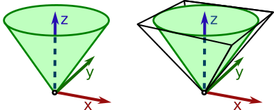

# Contact models
Contact models describe the constraints that have to be generated for each contact point. Currently, **nphysics**
supports two simple contact models: the [signorini](#signorini-model) model and an approximation of the
[signorini-coulomb](#signorini-coulomb-model) model. By default, the approximate signorini-coulomb contact model
`SignoriniCoulombPyramid` is used. This can be changed by the `mechanical_world.solver.set_contact_model(...)`
[method](/rustdoc/nphysics3d/world/struct.World.html#method.set_contact_model). Note however that it is strongly
recommended to perform this change only before any call to `mechanical_world.step(...)` as changing the contact model during the
simulation will cause all the internal solver cache to be cleared, resulting in a potential drop of performance and
accuracy for a few frames.

## Signorini model
The goal of the Signorini contact model is to prevent penetrations. Therefore, given two contact points, it ideally ensures:

1. The existing penetration (if any) will be corrected.
2. Further movements that would increase penetration will be prevented.

The **nphysics** implementation of the Signorini contact model is available through the `SignoriniModel` structure.
It also includes handling of restitution which coefficient depends on the
[materials](/rustdoc/nphysics3d/object/struct.Material.html) of the colliders in contact. Given two collider with
restitution coefficients set to $e_1$ and $e_2$, the actual restitution coefficient $e$ considered by the `SignoriniModel`
for their contacts will be $e = \frac{e_1 + e_2}{2}$. Overall, the `SignoriniModel` will generate a single constraint
for each contact.

!!! Warning
    The Signorini contact model does not handle friction at all.

## Signorini-Coulomb model
The Signorini-Coulomb contact model combines the non-penetration constraint of the aforementioned Signorini model with
additional constraints to handle friction. The **nphysics** implements an approximation of the Coulomb friction model
which states that friction forces are restricted to a friction cone. The `SignoriniCoulombPyramidModel` structure
implements friction by approximating the friction cone (left) by a pyramid (right):

In 2D, this pyramidal representation is actually exact since only one friction direction is possible. In 3D however
this is an approximation since the boundaries of the friction cone are now polyhedral instead of smooth. The consequence
is that the resulting friction force actually applied at the contact point will be stronger than it should in some
directions (namely directions that are not collinear with the coordinate axises). Overall, the `SignoriniCoulombPyramidModel`
will generate one constraint for handling both non-penetration and restitution (just like the `SignoriniModel`) as well
as one additional constraint in 2D (or two additional constraints in 3D) for handling friction. This is the contact model
used by default by the physics world.
